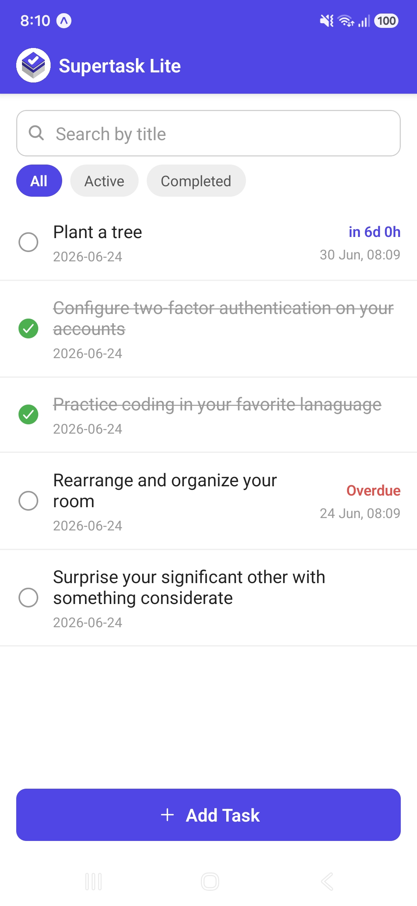
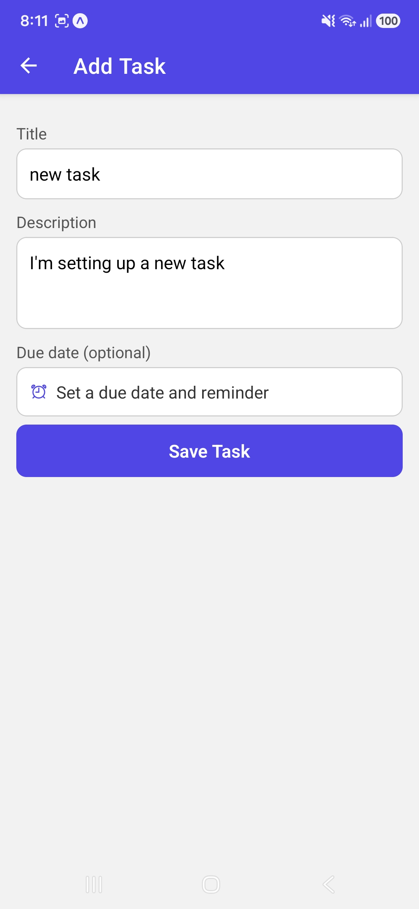
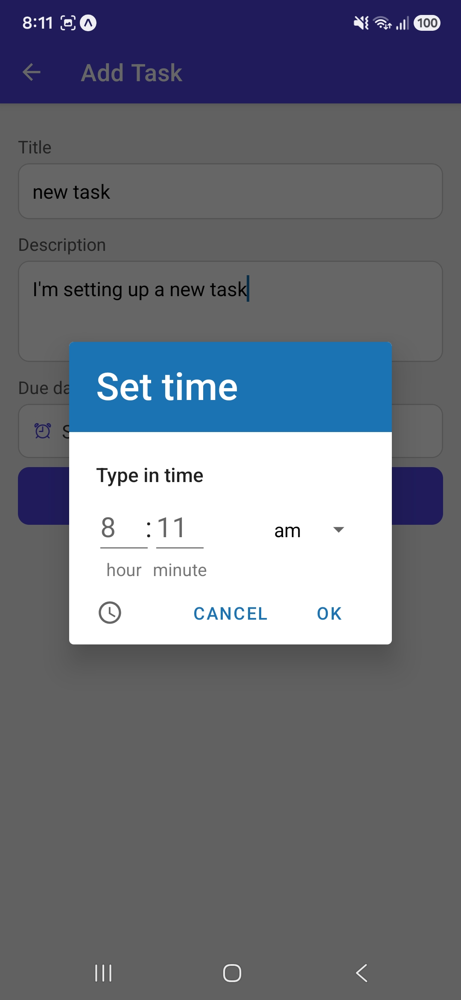
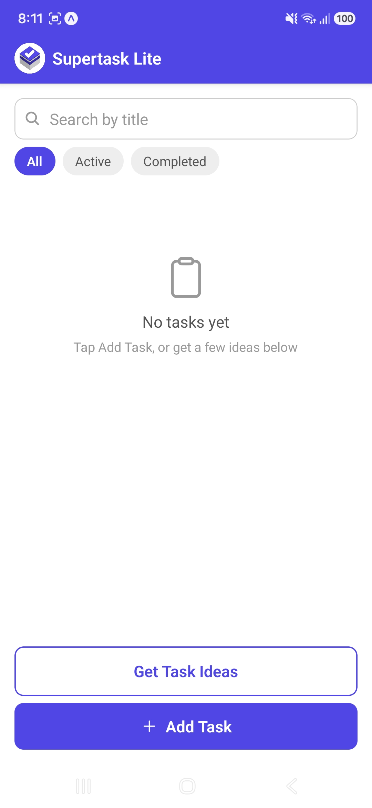
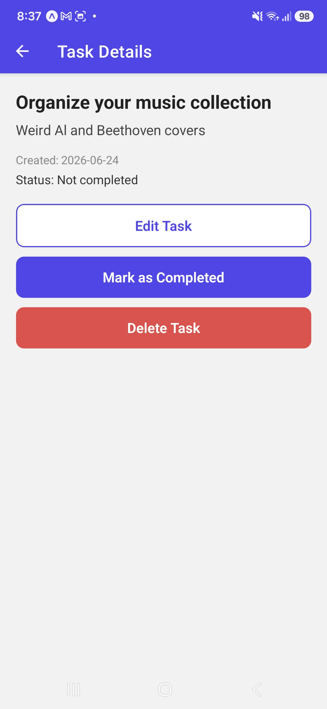
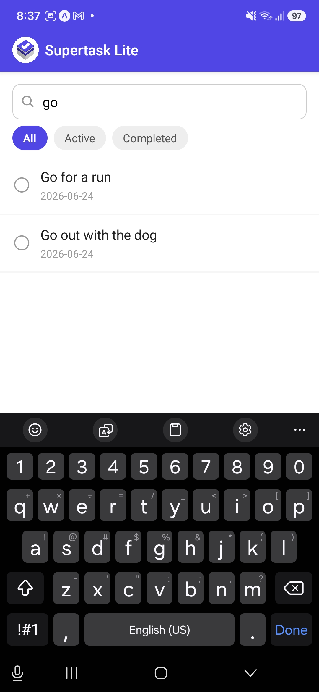
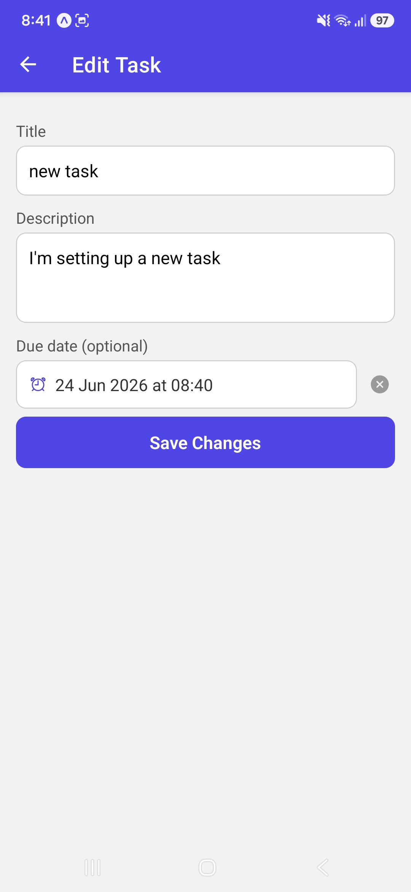

# Supertask Lite

A simple React Native task manager app built with Expo. Built as a technical task for PRITECH.

## Features

- View a list of personal tasks
- Add a new task with a title and description
- Edit an existing task
- Mark a task as completed or not completed
- Delete a task, with a confirmation prompt
- View task details
- Basic input validation (title cannot be empty)
- Search tasks by title
- Filter tasks by status (All / Active / Completed)
- Tasks are saved locally on the device using AsyncStorage
- Optional due dates, with a real scheduled reminder notification on the device
- "Get Task Ideas" button that fetches real activity suggestions from a public API and adds them as tasks, only shown while you have fewer than 5 tasks
- Custom app icon

## Tech stack

- React Native (Expo)
- JavaScript
- React Navigation
- React Context for shared state
- AsyncStorage
- expo-notifications
- @react-native-community/datetimepicker

## Setup instructions

1. Install Node.js (LTS version) if you don't already have it.
2. Install the Expo Go app on your phone from the App Store or Google Play.
3. Clone this repository:

```
git clone <repo-url>
cd <folder-name>
```

4. Install dependencies:

```
npm install
```

5. Start the project:

```
npx expo start
```

6. Scan the QR code shown in the terminal with the Expo Go app on your phone.
7. On first launch, allow notification permissions when prompted, this enables the due date reminder feature.

## What was implemented

This app lets a user manage a small list of personal tasks. Tasks are added or edited through a form with title and description fields, with validation that blocks an empty title. Each task can be marked complete or not completed, and deleted with a confirmation step. Task data is stored centrally using React Context and persisted on the device with AsyncStorage, so it survives the app being fully closed and reopened. A search bar filters tasks by title in real time, and three filter chips (All, Active, Completed) narrow the list by status. Tasks can optionally have a due date, which schedules a real local notification on the device and shows a live countdown on the task row. A "Get Task Ideas" button fetches real activity suggestions from a public API and adds them as starter tasks, intended for when the list is still mostly empty.

## Screenshots









## Notes

- Built entirely with functional components and hooks (useState, useEffect, useContext).
- Navigation between screens is handled with React Navigation.
